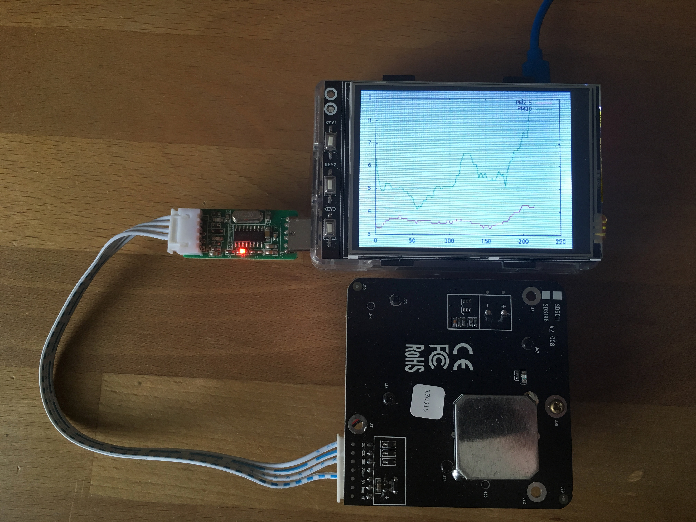

# FeinstaubPI
measure "Feinstaub" using a SDS011 sensor with RaspberryPI incl. graphical output

Prerequisites are:

* sudo apt-get install fbi
* sudo apt-get install gnuplot
* Installation of JOY-IT as default framebuffer device (see PDF)

Finally modify .bashrc to start the script automatically. At every startup the current data set is compressed into a tar file.
